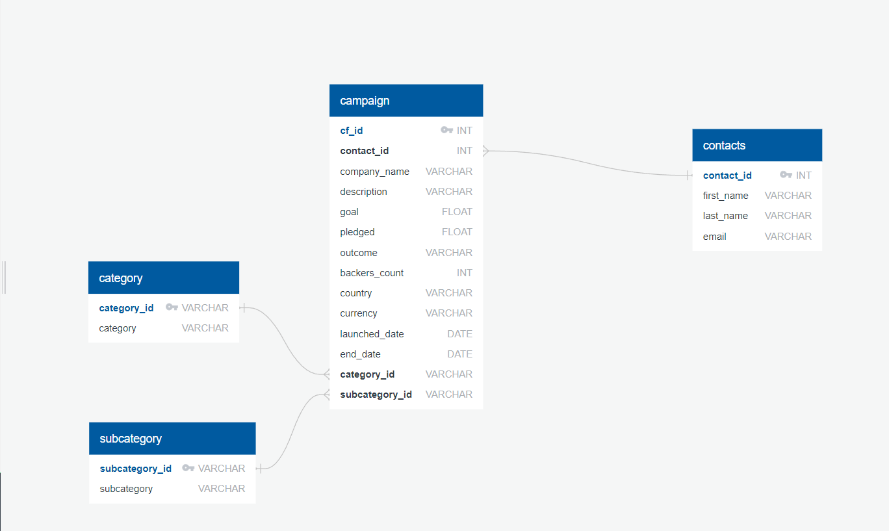

# Crowdfunding_ETL

A mini project performing ETL skills on a large dataset. Python was used to extract and transform, SQL is used to load and query the data.

## Overview 

For this ETL mini project, We practised building an ETL pipeline using Python, Pandas, and either Python dictionary methods or regular expressions to extract and transform the data.

After the data is transformed, we created four CSV files and use the CSV file data to create an ERD and a table schema. Finally, uploaded the CSV file data into a Postgres database.

Using Python, Pandas, Jupyter Notebook, and a PostgreSQL(pgAdmin) database:

 * Extracted and transformed data from a large Excel file into smaller CSV files
 * Created a PostgreSQL database and tables by using an ERD
 * Loaded CSV files into a database
 * Ran queries to retrieve data and generate reports for stakeholders

 ERD Diagram Created :
 
 
 Work Split:
  
 We both equally splitted the work, worked on Data Analysis our own and then combined our notebook into one after reviewing both.
 
 Zaid woked on creating th ERD diagram and Lintu worked on SQL queries to create the tables. We had some issues while importing the data that we were able to fix ourselves.
 
 Repository Structure : 
 
 Resources Folder --> Contains all the csv (were exported after the analysis) and xlsx files (were given as part of the project)
 
 
  * crowdfunding.xlsx - File provided that contains the uncleaned campaign data
  * contacts.xlsx - Contact file with contact data in json format
  * category.csv - cleaned category file with SubCategory data split from crowdfunding excel
  * subcategory.csv - cleaned category file with SubCategory data split from crowdfunding excel
  * campaign.csv - Cleaned campaign data file
 
 Images folder --> Contains screenshot of the data from the Database Tables
 
 ETL_Mini_Project_LBaby.ipynb --> Data Analysis Jupyter notebook
 
 ERD.png --> ERD diagram to display the Relationship between the tables
 
 crowdfunding_db_schema.sql --> Table creation/ Select queries
